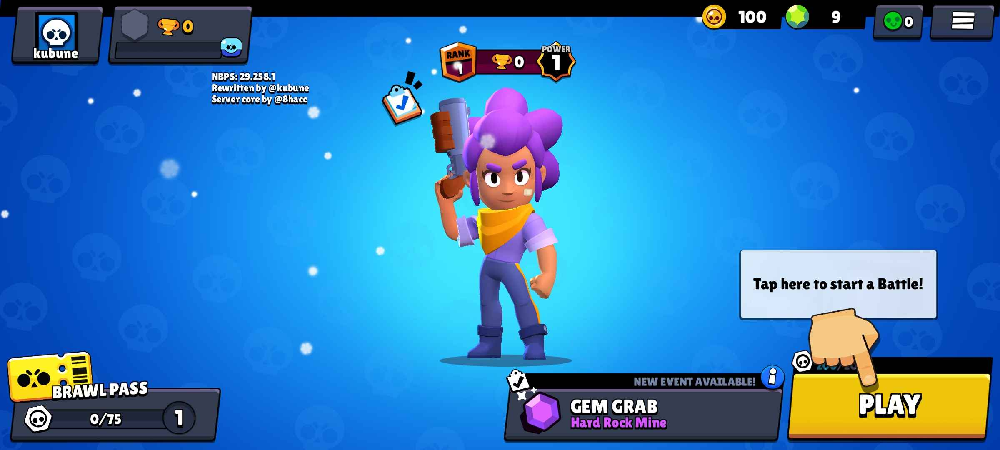

# NBPS

Brawl Stars v29 private server written in Python.
I changed the project structure. And I'll add more features soon.

- Forked from [PBSS](https://github.com/8-bitHacc/PBSS) that's based on [Classic Brawl](https://github.com/PhoenixFire6934/Classic-Brawl)

 

### Requirements:
- Python 3.7 or higher (I suggest Python 3.12)

### Features:
- Earning Trophies
- Shop
- Clubs
- Leaderboards (broken right now)
- Maintenance
- Commands (Default key for them is "/")
- Custom Inbox! (You can edit it in Inbox/Files/index.html)
- Banning
- Custom Lobby Info (on/off)
- Tutorial (on/off)

### How to run the server?
In a terminal (Windows Termnial/cmd), type __`pip install -r requirements.txt`__ then __`python main.py`__

### How to play?
To connect to the private server, you need a **patched client**.
I will upload it here soon as well as frida script.

### Need help?
- Open an issue or text me on **Discord**: @kubune
- Don't open joke issues, please.

### Special thanks
- itstermoh - for his Debugger script. 💙

- [8hacc](https://github.com/8-bitHacc/) - for the project core (PBSS) as well as getting me into the modding scene of Brawl Stars 💙.

- [HaccerCat](https://github.com/HaccerCat/) - for the original fork with SQLite3 DataBase.
- [Lwitchy](https://github.com/Lwitchy/) - Client.
